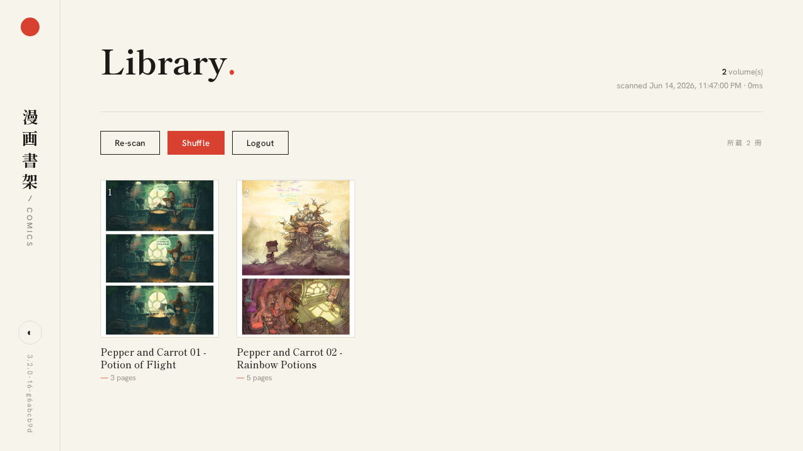
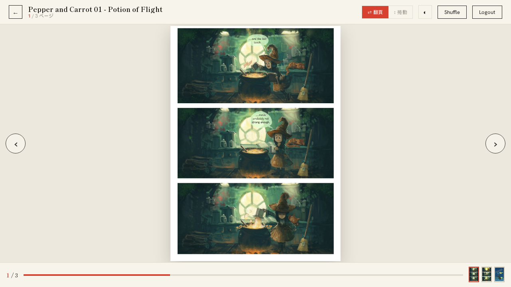
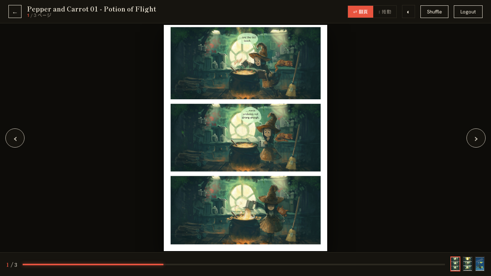

# Comics

> Simple file server for comic books

[](https://github.com/henry40408/comics/actions/workflows/ci.yml)
[](https://codecov.io/gh/henry40408/comics)
[](https://github.com/henry40408/comics/releases/latest)
[](LICENSE.txt)
[](https://www.rust-lang.org/)
[](https://ghcr.io/henry40408/comics)
[](https://casuallymaintained.tech/)
[](https://claude.com/claude-code)

This project provides a self-hosted solution to serve comic books.

|       | Library                                                        | Reader                                                       |
| ----- | -------------------------------------------------------------- | ----------------------------------------------------------- |
| Light |     |    |
| Dark  |       |      |

> Sample artwork: [Pepper&Carrot](https://www.peppercarrot.com/) by David Revoy, CC-BY 4.0.

## Background

While several options exist for self-hosted comic readers like [Calibre](https://github.com/janeczku/calibre-web), [Komga](https://github.com/gotson/komga), and [Tanoshi](https://github.com/faldez/tanoshi), they often come with complications in setup or format restrictions. Comics seeks to offer a straightforward alternative.

## Features

- **Simple Structure**: Comics looks only at the immediate subdirectories of your chosen folder. Each directory is treated as a book, and the files inside as the pages. No nested subfolders will be scanned. This simplicity ensures you have a clear structure for your comics.
- **Manga-friendly Reader**: Read right-to-left page by page or as a continuous vertical scroll, switchable on the fly. Includes a progress bar, a thumbnail strip for jumping between pages, keyboard navigation, and a light/dark theme that follows your system and can be toggled manually. Covers and the thumbnail strip are served as small JPEG thumbnails generated on demand and cached on disk, so browsing stays light even on slow storage.
- **Web Login**: Safeguard your comics with a username-password login form backed by a signed session cookie (valid for 7 days). Credentials are verified once at login instead of on every request, and every page — including the images and thumbnails themselves — is served only to logged-in users. See [Commands](#commands) and [Configuration](#configuration) for setup.

## Configuration

| Variable | Description | Default |
| --- | --- | --- |
| `AUTH_USERNAME` | Username for the login form | _(none)_ |
| `AUTH_PASSWORD_HASH` | Hashed password for the login form | _(none)_ |
| `BIND` | Bind host & port (defaults to loopback; the container image sets `0.0.0.0:8080` so a reverse proxy can reach it) | `127.0.0.1:8080` |
| `DATA_DIR` | Data directory | `./data` |
| `CACHE_DIR` | Directory for cached thumbnails | `comics-thumbs` under the system temp dir |
| `LOG_FORMAT` | Log format (`full`, `compact`, `pretty`, `json`) | `full` |
| `NO_COLOR` | Disable color output ([no-color.org](https://no-color.org/)) | _(off)_ |
| `SEED` | Seed to generate hashed IDs | _(random)_ |

## Quick Start

1. **Getting Started**:

   - Clone the repository to your local machine.
   - Navigate to the project directory and install any required dependencies (if applicable).

2. **Organize Your Comics**:

Make sure you have your comics structured as shown below:

```
data
├── book1
│   ├── page1.jpg
│   ├── page2.jpg
│   └── page3.jpg
├── book2
│   ├── page1.jpg
│   ├── page2.jpg
│   └── page3.jpg
└── book3
    ├── page1.jpg
    ├── page2.jpg
    └── page3.jpg
```

Each book directory represents an individual comic book, with image files as the pages.

3. **Run the Server**:

Navigate to the project directory in your terminal or command line and enter:

```bash
./comics
```

Now, open your web browser and head to http://localhost:8080/ to view your comics.

## Commands

### `hash-password`

Generate a bcrypt-hashed password for the login form:

```bash
$ comics hash-password
Password:
Confirmation:
$2a$10$...Ot6
```

### `list` (alias: `ls`)

List all books and their page counts:

```bash
$ comics list
Book Title 1 (10P)
Book Title 2 (5P)
2 book(s), 15 page(s), scanned in 1.23ms
```

## Need Help?

For a comprehensive list of options, type:

```bash
./comics -h
```

## License

MIT
