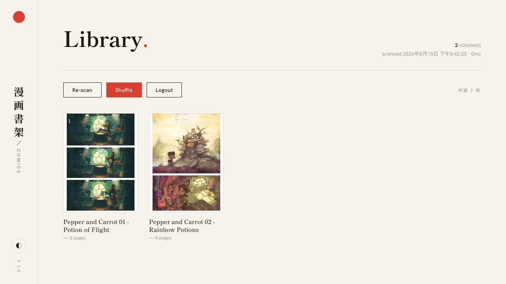
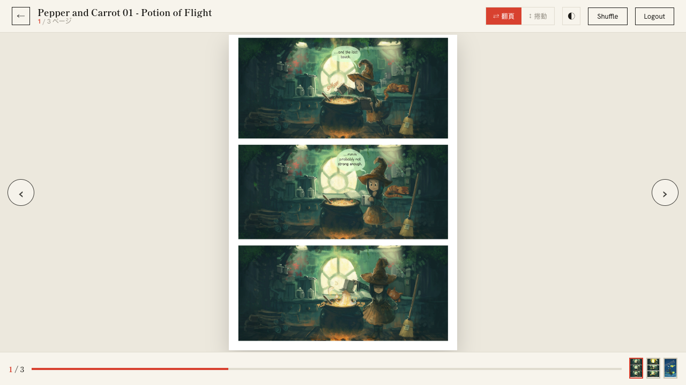
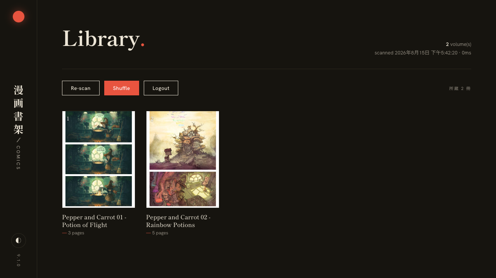
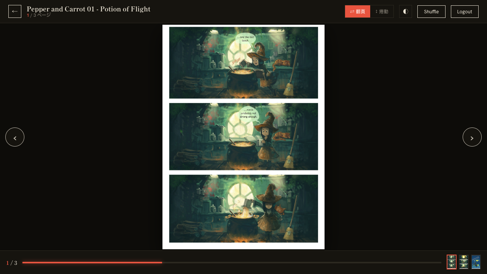

# Comics

> Simple file server for comic books

[](https://github.com/henry40408/comics/actions/workflows/ci.yml)
[](https://codecov.io/gh/henry40408/comics)
[](https://github.com/henry40408/comics/releases/latest)
[](LICENSE.txt)
[](https://www.rust-lang.org/)
[](https://ghcr.io/henry40408/comics)
[](https://casuallymaintained.tech/)
[](https://claude.com/claude-code)

This project provides a self-hosted solution to serve comic books.

|       | Library                                                        | Reader                                                       |
| ----- | -------------------------------------------------------------- | ----------------------------------------------------------- |
| Light |     |    |
| Dark  |       |      |

> Sample artwork: [Pepper&Carrot](https://www.peppercarrot.com/) by David Revoy, CC-BY 4.0.

## Background

While several options exist for self-hosted comic readers like [Calibre](https://github.com/janeczku/calibre-web), [Komga](https://github.com/gotson/komga), and [Tanoshi](https://github.com/faldez/tanoshi), they often come with complications in setup or format restrictions. Comics seeks to offer a straightforward alternative.

## Features

- **Simple Structure**: Comics looks only at the immediate subdirectories of your chosen folder. Each directory is treated as a book, and the files inside as the pages. No nested subfolders will be scanned. This simplicity ensures you have a clear structure for your comics.
- **Manga-friendly Reader**: Read right-to-left page by page or as a continuous vertical scroll, switchable on the fly. Includes a progress bar, a thumbnail strip for jumping between pages, keyboard navigation, and a light/dark theme that follows your system and can be toggled manually. Covers and the thumbnail strip are served as small JPEG thumbnails generated on demand and cached on disk, so browsing stays light even on slow storage.
- **Web Login**: Safeguard your comics with a username-password login form. Credentials are verified once at login instead of on every request, and every page — including the images and thumbnails themselves — is served only to logged-in users. Sessions last 7 days, or 3 days without a visit, and logging out ends them immediately on the server. See [Commands](#commands) and [Configuration](#configuration) for setup.

## Configuration

| Variable | Description | Default |
| --- | --- | --- |
| `COMICS_AUTH_USERNAME` | Username for the login form | _(none)_ |
| `COMICS_AUTH_PASSWORD_HASH` | Hashed password for the login form (Argon2id; the server refuses to start if it is not one) | _(none)_ |
| `COMICS_COOKIE_SECURE` | Send the session cookie with the `Secure` attribute (enable when served over HTTPS) | _(off)_ |
| `COMICS_SECRET` | The one secret: at least 64 hex characters (`openssl rand -hex 32`). Signs the session cookie and salts hashed book/page IDs | _(random per start)_ |
| `COMICS_HSTS_MAX_AGE` | Send `Strict-Transport-Security` with this `max-age` in seconds (e.g. `63072000`) | _(off)_ |
| `COMICS_TRUSTED_PROXIES` | Reverse proxies whose `X-Forwarded-For` may set the login rate-limit key: comma-separated IPs and CIDR prefixes (e.g. `172.16.0.0/12,10.0.0.2`) | _(empty — header ignored)_ |
| `COMICS_DISABLE_CSRF_GUARD` | Turn off the CSRF origin check entirely (`true`/`false`) — an escape hatch for plain-HTTP LAN hosts locked out of the login form | _(off)_ |
| `COMICS_BIND` | Bind host & port (defaults to loopback; the container image sets `0.0.0.0:8080` so a reverse proxy can reach it) | `127.0.0.1:8080` |
| `COMICS_DATA_DIR` | Data directory | `./data` |
| `COMICS_CACHE_DIR` | Directory for cached thumbnails | `comics-thumbs` under the system temp dir |
| `COMICS_LOG_FORMAT` | Log format (`full`, `compact`, `pretty`, `json`) | `full` |
| `NO_COLOR` | Disable color output ([no-color.org](https://no-color.org/)) | _(off)_ |

> **`COMICS_SECRET`:** generate one with `openssl rand -hex 32` and supply it
> through the environment or a secret file — never on a shell command line (it
> lands in the history) and never committed. Two independent values are derived
> from it, each behind its own domain-separated hash: the key that signs session
> cookies, and the seed that salts hashed book and page IDs. Without it a random
> secret is generated at each start, which changes every book/page URL on
> restart. Rotating the value does the same on purpose. It does **not** control
> how long you stay logged in — see the session note below.

> **Sessions:** logging in opens a session that comics holds in memory, and the
> cookie carries only an opaque identifier for it. That is what makes logging out
> actually work: the session is deleted server-side, so a copy of the cookie
> taken beforehand stops working immediately rather than lasting until it
> expires.
>
> The trade is that **restarting comics logs everyone out** — including a
> container update — because the sessions were only ever in memory. In practice
> this replaces a schedule you already had: sessions expire after 7 days
> regardless of activity, or 3 days without a request, so a restart is usually
> the rarer of the two. Log in again and carry on. It also gives you a cheap
> panic button: if you think a session cookie has leaked, restarting revokes
> every session without changing a single URL.
>
> The cookie is `SameSite=Strict`, so **following a link into comics from
> somewhere else shows the login page even when you are already signed in** —
> the browser withholds the cookie on that first cross-site navigation. Reload,
> or navigate from within comics, and you are through. This is deliberate: comics
> has no third-party sign-in or payment flow that needs to land on an
> authenticated page, so the stricter setting costs almost nothing.

> **Audit logging:** logins, logouts, expiries, failed logins and throttled
> attempts are logged with the client IP and `User-Agent` (and, for sessions, a
> salted hash of the session identifier — never the identifier itself, and never
> the submitted username or password). Two `WARN`s are worth alerting on because
> they cannot happen by accident: `session_rejected` with `reason=bad_signature`
> or `reason=malformed` means a cookie this server never issued. A cookie that is
> merely stale — after a restart, say — logs at `DEBUG` instead, so an upgrade
> does not fill the log. If you would rather not record IP and `User-Agent`, drop
> the level with `RUST_LOG` (e.g. `RUST_LOG=comics=warn`).

> **Login throttling:** `POST /login` allows 5 *failed* attempts per client IP
> per 60 seconds, **and 20 across all addresses together**; further attempts get
> `429` until the window passes. A successful login costs nothing against either.
> The client IP is the TCP peer unless `COMICS_TRUSTED_PROXIES` says otherwise —
> see below. At most 10 000 sources are tracked individually; beyond that — a
> spray from more live addresses than the cap — further sources share one 5-per-60-seconds
> window until it passes, so the limit degrades to a coarser one rather than
> switching off.
>
> The global ceiling is what bounds an attacker spraying from addresses they hold
> in bulk, for whom a per-IP limit alone means nothing. The trade is that a
> sustained attack refuses *your* logins too, for at most the rest of the current
> minute — a fixed window rather than an escalating lockout, precisely so an
> attack cannot lock you out for longer than it lasts.

> **`COMICS_TRUSTED_PROXIES`:** set this to the address your reverse proxy
> *connects from*, not to the range your clients are in. Until you do,
> `X-Forwarded-For` is ignored entirely and every request behind the proxy shares
> the proxy's single rate-limit bucket — safe for a single-account service, but a
> burst of failed logins locks the form for a minute. The default is empty
> because the header is forgeable by anyone who can reach the port: believing it
> on presence alone would let an attacker mint a fresh bucket per request and
> bypass the limit outright. comics logs a warning the first time it drops an
> `X-Forwarded-For` from an unlisted peer, which is usually this setting missing.
>
> Once a peer is listed, the client is the rightmost `X-Forwarded-For` entry that
> is not itself in the list, so a chain of proxies works as long as every hop is
> listed. Common values: `127.0.0.1` for a proxy on the same host, or the compose
> network's subnet (`172.16.0.0/12` covers Docker's default range) when the proxy
> is a sibling container.

> **`COMICS_COOKIE_SECURE`:** comics never terminates TLS itself, so it cannot
> tell whether it is reached over HTTPS behind a reverse proxy — hence the
> explicit opt-in. Turn it on when the site is always served over HTTPS. Setting
> it on a plain-HTTP deployment makes browsers silently discard the session
> cookie, so login will appear to do nothing. Enabling it also renames the cookie
> to `__Host-comics_session` (the prefix requires `Secure`), so existing sessions
> are logged out once — in both directions of the switch.

> **`COMICS_HSTS_MAX_AGE`:** prefer configuring HSTS on the reverse proxy that
> terminates TLS; this flag exists for deployments that cannot. Enable it only
> when comics is always reached over HTTPS: a browser that has seen the header
> will refuse plain HTTP to this host for the whole `max-age`, and recovering
> means clearing the browser's HSTS entry by hand (`chrome://net-internals/#hsts`).
> `includeSubDomains` and `preload` are deliberately not offered — their blast
> radius covers the whole domain, so they belong to whoever operates the proxy.

> **`COMICS_DISABLE_CSRF_GUARD`:** every state-changing request is checked
> against `Sec-Fetch-Site`, falling back to comparing `Origin` with `Host`.
> Browsers only send fetch metadata to *potentially trustworthy* origins — HTTPS,
> or `localhost` — so a plain-HTTP LAN host such as `http://nas.local` never
> receives `Sec-Fetch-Site` and always falls through to the `Origin` check. If
> the browser reports an opaque `Origin: null` there (a sandboxed iframe, or a
> privacy setting that suppresses the header), the login `POST` is rejected with
> a bare `403` — and because you cannot log in, there is no way back from inside
> the app. This flag exists for exactly that dead end; it removes the check from
> the request path altogether and logs a warning at startup. Reaching the server
> over HTTPS, or through an SSH tunnel to `localhost`, restores `Sec-Fetch-Site`
> and fixes the same lockout while giving nothing up, so prefer either where you
> can. What still protects you with the flag on is the session cookie's
> `SameSite=Strict`, which is what actually stops a cross-site `POST` from
> carrying credentials — this check is defence in depth on top of it, not the
> only lock. Accepts `true`/`false` only, not `1`/`0`.

> **Security headers:** every response carries a `Content-Security-Policy`
> (`default-src 'none'`, no `'unsafe-inline'`), `X-Content-Type-Options`,
> `X-Frame-Options`, `Referrer-Policy`, `Cross-Origin-Resource-Policy`,
> `Cross-Origin-Opener-Policy` and a `Permissions-Policy` that denies the
> features comics never uses. None of these are configurable — they describe
> what the app actually loads, so anything looser would only be wrong. The one
> third party in the policy is `fonts.bunny.net`, which serves the webfonts.
> Behind a reverse proxy, check that it does not also add its own copies: two
> `Content-Security-Policy` headers are intersected, not merged, and the result
> is usually a blank page.

> **Migrating from an older release:** `COMICS_SEED` and `COMICS_SESSION_KEY`
> were folded into the single `COMICS_SECRET` both are now derived from, and
> before that these variables were unprefixed (`BIND`, `SEED`, `AUTH_USERNAME`,
> …). To catch stale configuration, the server **refuses to start** if any
> retired name is still set — rename (or unset) it. `NO_COLOR` is unchanged.
>
> Moving to `COMICS_SECRET` is a breaking change in both directions: the derived
> signing key differs from the old `COMICS_SESSION_KEY` (so everyone is logged
> out once) and the derived seed differs from the old `COMICS_SEED` (so every
> book and page URL changes once). Bookmarks pointing at the old URLs will 404.

## Quick Start

1. **Getting Started**:

   - Clone the repository to your local machine.
   - Navigate to the project directory and install any required dependencies (if applicable).

2. **Organize Your Comics**:

Make sure you have your comics structured as shown below:

```
data
├── book1
│   ├── page1.jpg
│   ├── page2.jpg
│   └── page3.jpg
├── book2
│   ├── page1.jpg
│   ├── page2.jpg
│   └── page3.jpg
└── book3
    ├── page1.jpg
    ├── page2.jpg
    └── page3.jpg
```

Each book directory represents an individual comic book, with image files as the pages.

3. **Run the Server**:

Navigate to the project directory in your terminal or command line and enter:

```bash
./comics
```

Now, open your web browser and head to http://localhost:8080/ to view your comics.

## Commands

### `hash-password`

Generate an Argon2id-hashed password for the login form:

```bash
$ comics hash-password
Password:
Confirmation:
$argon2id$v=19$m=19456,t=2,p=1$...
```

Passwords are hashed with **Argon2id**, which reads the whole password however
long it is — up to a 1 KiB backstop. A Traditional Chinese passphrase costs
three bytes per character, so that is roughly 341 characters.

> **Upgrading from a version that used bcrypt:** every existing
> `COMICS_AUTH_PASSWORD_HASH` stops working, and the server will refuse to start
> and tell you so rather than silently rejecting your password. Your password
> itself is unaffected — run `comics hash-password`, enter the same password, and
> replace the value with the new hash.

### `list` (alias: `ls`)

List all books and their page counts:

```bash
$ comics list
Book Title 1 (10P)
Book Title 2 (5P)
2 book(s), 15 page(s), scanned in 1.23ms
```

## Need Help?

For a comprehensive list of options, type:

```bash
./comics -h
```

## License

MIT
